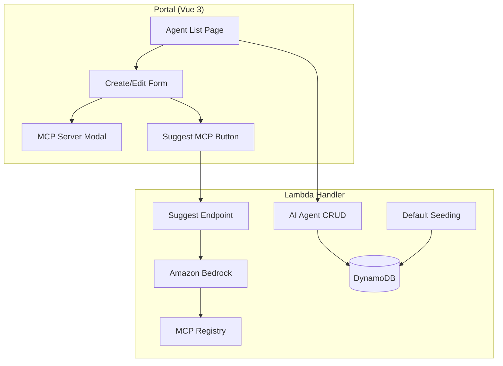

# Design Document: AI Agent Management

## Overview

AI Agent Management enables users to define and manage Kiro CLI agent configurations through the portal. Each agent config maps to a `kiro-agent.json` file that controls the agent's behavior, system prompt, and available MCP tools. The backend stores configs in DynamoDB and provides a Bedrock-powered suggestion endpoint. The portal features a full CRUD interface with modal forms for MCP server configuration.

### Key Design Decisions

1. **DynamoDB single-table pattern**: AI agent configs use `PK=AI_AGENT#{id}, SK=CONFIG` in the shared single table, consistent with the existing data model.

2. **Curated MCP registry in handler code**: The MCP server registry is defined as a static data structure in the Lambda handler rather than a separate DynamoDB table. This simplifies updates (code deploy vs. data migration) and keeps the registry versioned with the codebase.

3. **Bedrock Converse API for suggestions**: Uses `amazon.nova-lite-v1:0` via the Bedrock Converse API for cost-effective, low-latency suggestions. The model receives the agent category, description, and full registry as context.

4. **Default agent seeding**: On first `GET /ai-agents` call, if no agents exist, the handler seeds a set of default agents covering common categories (fullstack, code review, security review).

## Architecture



## Data Model

### AI Agent Record

```
PK: AI_AGENT#{aiAgentId}
SK: CONFIG
Attributes:
  aiAgentId: string (UUID)
  name: string
  description: string
  category: AIAgentCategory
  systemPrompt: string
  mcpServers: Record<string, KiroMcpServerEntry>
  createdBy: string
  createdAt: ISO timestamp
  updatedAt: ISO timestamp
```

### KiroMcpServerEntry

```typescript
interface KiroMcpServerEntry {
  command: string;
  args?: string[];
  env?: Record<string, string>;
  timeout?: number;
  disabled?: boolean;
  autoApprove?: string[];
}
```

## MCP Server Registry Categories

The curated registry includes servers organized into:
- **Filesystem**: filesystem, desktop-commander
- **Database**: sqlite, postgres, mysql, redis, mongodb
- **Cloud/AWS**: aws-kb-retrieval, cloudformation, cdk
- **Web/API**: fetch, puppeteer, playwright, brave-search
- **Development**: git, github, gitlab, docker, kubernetes
- **Data/Analytics**: bigquery, snowflake, elasticsearch
- **Communication**: slack, linear, notion, memory

## API Endpoints

| Method | Path | Description |
|--------|------|-------------|
| GET | `/ai-agents` | List all AI agent configurations |
| GET | `/ai-agents/{id}` | Get a specific AI agent |
| POST | `/ai-agents` | Create a new AI agent |
| PUT | `/ai-agents/{id}` | Update an existing AI agent |
| DELETE | `/ai-agents/{id}` | Delete an AI agent |
| POST | `/ai-agents/{id}/suggest-mcp` | Get Bedrock-powered MCP server suggestions |
