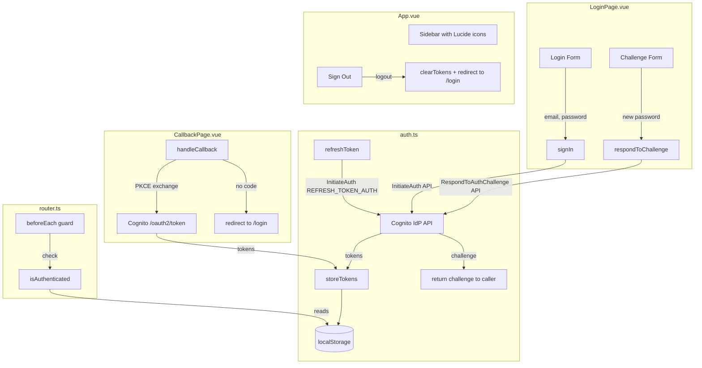
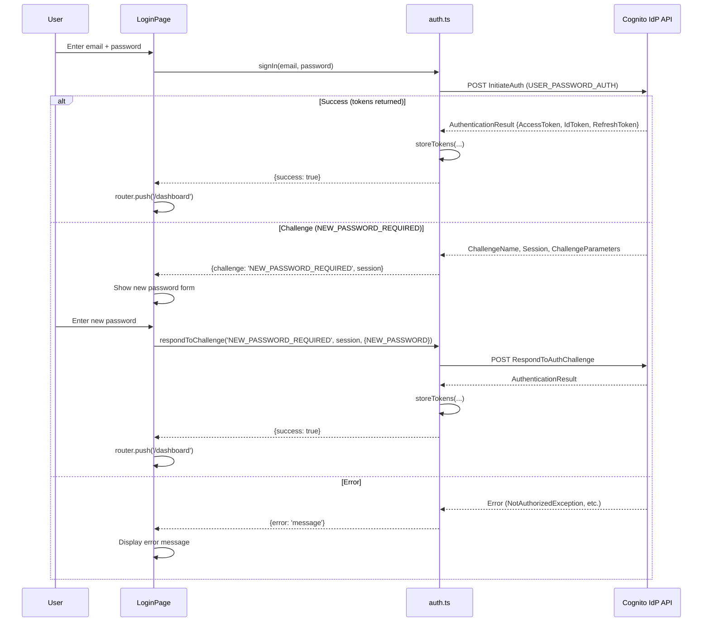
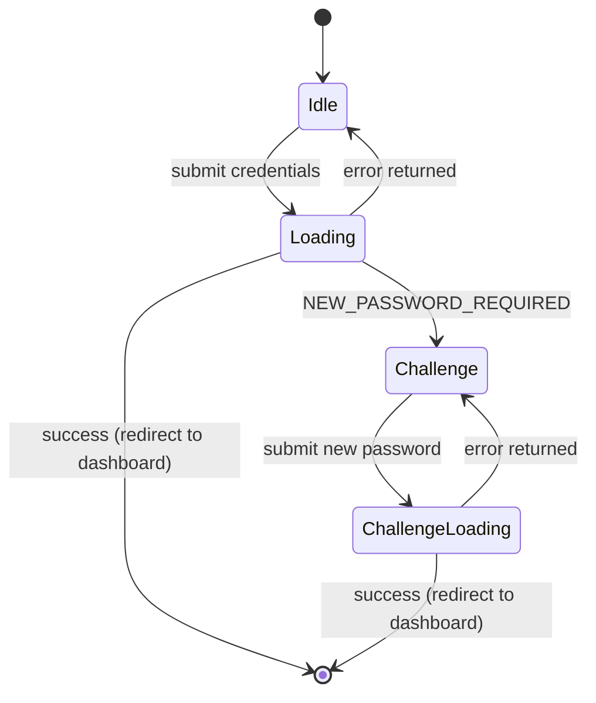

# Design Document: Custom Auth UI

## Overview

This feature replaces the portal's redirect-based Cognito hosted UI login with an inline login form that authenticates directly against the Cognito Identity Provider REST API, and modernizes the portal's visual identity with SVG icons, a refined color palette, and improved layout.

The current `auth.ts` module uses OAuth2 Authorization Code Flow with PKCE, redirecting users to `${COGNITO_DOMAIN}/oauth2/authorize` and exchanging codes at `${COGNITO_DOMAIN}/oauth2/token`. The new approach calls the Cognito Identity Provider `InitiateAuth` and `RespondToAuthChallenge` API actions directly via `fetch`, eliminating the redirect entirely for the primary login flow. The callback page remains functional for backward compatibility during transition.

The visual overhaul replaces emoji icons with `lucide-vue-next` SVG components, updates the CSS custom property design system with a more intentional color palette, and refines sidebar spacing and typography.

### Key Design Decisions

1. **Raw `fetch` over AWS SDK**: The Cognito Identity Provider API is a simple JSON-over-HTTPS API. Using raw `fetch` avoids adding `@aws-sdk/client-cognito-identity-provider` (~200KB+ bundled) for just two API calls. The request format is a POST to `https://cognito-idp.{region}.amazonaws.com/` with `X-Amz-Target` headers.

2. **Region extraction from COGNITO_DOMAIN**: The existing `VITE_COGNITO_DOMAIN` env var contains the region (e.g., `https://dev-remote-kiro-*.auth.ap-south-1.amazoncognito.com`). We parse the region from this URL rather than adding a new env var.

3. **lucide-vue-next for icons**: Lucide provides tree-shakeable Vue 3 components, each icon is ~1KB, and they render as inline SVG inheriting parent `color` and `size` props. No icon font or sprite sheet needed.

4. **Preserve existing token storage**: All localStorage keys (`kiro_access_token`, `kiro_refresh_token`, `kiro_id_token`, `kiro_token_expiry`) remain unchanged so existing sessions survive the migration.

## Architecture



### Authentication Flow (New)



## Components and Interfaces

### auth.ts — Refactored Public API

```typescript
// ─── Types ───

interface AuthSuccess {
  success: true;
}

interface AuthChallenge {
  challenge: string;       // e.g. 'NEW_PASSWORD_REQUIRED'
  session: string;         // opaque session token from Cognito
  parameters: Record<string, string>; // ChallengeParameters
}

interface AuthError {
  error: string;           // human-readable error message
}

type SignInResult = AuthSuccess | AuthChallenge | AuthError;
type ChallengeResult = AuthSuccess | AuthError;

// ─── New Functions ───

/** Authenticate with email/password via Cognito InitiateAuth API. */
export async function signIn(email: string, password: string): Promise<SignInResult>;

/** Respond to an auth challenge (e.g. NEW_PASSWORD_REQUIRED). */
export async function respondToChallenge(
  challengeName: string,
  session: string,
  responses: Record<string, string>
): Promise<ChallengeResult>;

// ─── Modified Functions ───

/** Clears tokens and redirects to /login (no longer redirects to Cognito logout). */
export function logout(): void;

/** Refreshes via InitiateAuth REFRESH_TOKEN_AUTH (no longer calls /oauth2/token). */
export async function refreshToken(): Promise<boolean>;

// ─── Unchanged Functions ───
export function getToken(): string | null;
export function isAuthenticated(): boolean;
export async function getValidToken(): Promise<string | null>;

// ─── Kept for Backward Compatibility ───
export async function handleCallback(code: string): Promise<boolean>;
```

### Internal Helper: Cognito API Call

```typescript
const COGNITO_REGION = parseCognitoRegion(COGNITO_DOMAIN);
// e.g. "ap-south-1" extracted from "https://...auth.ap-south-1.amazoncognito.com"

const COGNITO_IDP_ENDPOINT = `https://cognito-idp.${COGNITO_REGION}.amazonaws.com/`;

async function cognitoRequest(action: string, payload: Record<string, unknown>): Promise<Response> {
  return fetch(COGNITO_IDP_ENDPOINT, {
    method: 'POST',
    headers: {
      'Content-Type': 'application/x-amz-json-1.1',
      'X-Amz-Target': `AWSCognitoIdentityProviderService.${action}`,
    },
    body: JSON.stringify(payload),
  });
}
```

### LoginPage.vue — Component States

The login page manages a state machine with four states:



```typescript
// Reactive state in LoginPage.vue <script setup>
type FormState = 'idle' | 'loading' | 'challenge' | 'challenge-loading';

const state = ref<FormState>('idle');
const email = ref('');
const password = ref('');
const newPassword = ref('');
const errorMessage = ref('');
const challengeSession = ref('');
```

Template structure:
- **Idle/Loading**: Email input, password input, submit button (disabled when loading)
- **Challenge/ChallengeLoading**: New password input, submit button, back link
- **Error**: Inline error message below the form (any state)

### App.vue — Sidebar with Lucide Icons

```vue
<script setup>
import {
  LayoutDashboard,
  FolderGit2,
  Puzzle,
  PlusCircle,
  Settings,
  LogOut,
  Zap
} from 'lucide-vue-next';
</script>

<!-- Usage in template -->
<LayoutDashboard :size="18" />
<FolderGit2 :size="18" />
```

Icon mapping:
| Current Emoji | Lucide Component | Nav Item |
|---|---|---|
| 📊 | `LayoutDashboard` | Dashboard |
| 📁 | `FolderGit2` | Repositories |
| 🧩 | `Puzzle` | Profiles |
| ➕ | `PlusCircle` | New Job |
| ⚙️ | `Settings` | Admin |
| (none) | `LogOut` | Sign Out |
| ⚡ | `Zap` | Brand icon |

### CallbackPage.vue — Updated Logic

```typescript
onMounted(async () => {
  const params = new URLSearchParams(window.location.search);
  const code = params.get('code');

  if (!code) {
    // No authorization code — redirect to login
    router.replace({ name: 'login' });
    return;
  }

  // Attempt PKCE exchange for backward compatibility
  const success = await handleCallback(code);
  if (success) {
    router.replace({ name: 'dashboard' });
  } else {
    router.replace({ name: 'login' });
  }
});
```

## Data Models

### Cognito InitiateAuth Request/Response

**Request (USER_PASSWORD_AUTH):**
```json
{
  "AuthFlow": "USER_PASSWORD_AUTH",
  "ClientId": "<your-cognito-client-id>",
  "AuthParameters": {
    "USERNAME": "user@example.com",
    "PASSWORD": "secret"
  }
}
```

**Success Response:**
```json
{
  "AuthenticationResult": {
    "AccessToken": "eyJ...",
    "IdToken": "eyJ...",
    "RefreshToken": "eyJ...",
    "ExpiresIn": 3600,
    "TokenType": "Bearer"
  }
}
```

**Challenge Response:**
```json
{
  "ChallengeName": "NEW_PASSWORD_REQUIRED",
  "Session": "AYA...",
  "ChallengeParameters": {
    "USER_ID_FOR_SRP": "user@example.com",
    "requiredAttributes": "[]",
    "userAttributes": "{\"email\":\"user@example.com\"}"
  }
}
```

### Cognito RespondToAuthChallenge Request

```json
{
  "ChallengeName": "NEW_PASSWORD_REQUIRED",
  "ClientId": "<your-cognito-client-id>",
  "Session": "AYA...",
  "ChallengeResponses": {
    "USERNAME": "user@example.com",
    "NEW_PASSWORD": "newSecret123"
  }
}
```

### Cognito InitiateAuth Request (REFRESH_TOKEN_AUTH)

```json
{
  "AuthFlow": "REFRESH_TOKEN_AUTH",
  "ClientId": "<your-cognito-client-id>",
  "AuthParameters": {
    "REFRESH_TOKEN": "eyJ..."
  }
}
```

### Cognito Error Response

```json
{
  "__type": "NotAuthorizedException",
  "message": "Incorrect username or password."
}
```

Error types to handle:
- `NotAuthorizedException` — wrong credentials or expired token
- `UserNotFoundException` — user doesn't exist
- `UserNotConfirmedException` — user hasn't confirmed email
- `InvalidParameterException` — malformed request
- `NetworkError` — fetch failure

### localStorage Token Schema (Unchanged)

| Key | Value | Source |
|---|---|---|
| `kiro_access_token` | JWT access token | `AuthenticationResult.AccessToken` |
| `kiro_refresh_token` | Opaque refresh token | `AuthenticationResult.RefreshToken` |
| `kiro_id_token` | JWT ID token | `AuthenticationResult.IdToken` |
| `kiro_token_expiry` | Unix timestamp (ms) | Parsed from access token `exp` claim |

### CSS Design System Updates

**Color palette changes:**

```css
:root {
  /* Background & Surface — slightly warmer */
  --color-bg: #f8f9fb;
  --color-surface: #ffffff;

  /* Primary — shift from indigo to a deeper blue-slate */
  --color-primary: #2563eb;
  --color-primary-hover: #1d4ed8;
  --color-primary-light: #eff6ff;

  /* Text — unchanged, already good */
  --color-text: #1e293b;
  --color-text-secondary: #64748b;

  /* Border — slightly softer */
  --color-border: #e5e7eb;

  /* Semantic colors — unchanged */
  --color-danger: #ef4444;
  --color-danger-hover: #dc2626;
  --color-success: #22c55e;
  --color-warning: #f59e0b;

  /* New spacing tokens */
  --space-xs: 4px;
  --space-sm: 8px;
  --space-md: 16px;
  --space-lg: 24px;
  --space-xl: 32px;
  --space-2xl: 48px;
}
```

**Login page background:** Replace `linear-gradient(135deg, #eef2ff 0%, #f5f7fa 100%)` with a solid `var(--color-bg)` or a very subtle single-tone gradient using the new primary-light.


## Correctness Properties

*A property is a characteristic or behavior that should hold true across all valid executions of a system — essentially, a formal statement about what the system should do. Properties serve as the bridge between human-readable specifications and machine-verifiable correctness guarantees.*

### Property 1: signIn constructs a valid InitiateAuth request

*For any* non-empty email and password string, calling `signIn(email, password)` shall produce a POST request to the Cognito IdP endpoint with `AuthFlow` set to `USER_PASSWORD_AUTH`, `ClientId` matching the configured client ID, and `AuthParameters` containing `USERNAME` equal to the email and `PASSWORD` equal to the password.

**Validates: Requirements 1.2, 3.1**

### Property 2: Token storage round-trip

*For any* valid `AuthenticationResult` containing an access token, ID token, and refresh token, after `storeTokens` is called, reading `localStorage` keys `kiro_access_token`, `kiro_id_token`, and `kiro_refresh_token` shall return the exact same token strings that were stored.

**Validates: Requirements 1.3, 2.3, 3.4**

### Property 3: Cognito error messages are propagated

*For any* Cognito error response with a `__type` and `message` field, calling `signIn` shall return an `AuthError` result whose `error` field contains the error message from the response, without throwing an exception.

**Validates: Requirements 1.5**

### Property 4: Empty or whitespace-only credentials are rejected

*For any* email or password string composed entirely of whitespace characters (including the empty string), the login form validation shall prevent form submission and the `signIn` function shall not be called.

**Validates: Requirements 1.7**

### Property 5: respondToChallenge constructs a valid RespondToAuthChallenge request

*For any* challenge name, session string, and responses record, calling `respondToChallenge(challengeName, session, responses)` shall produce a POST request to the Cognito IdP endpoint with `ChallengeName` matching the input, `Session` matching the input, `ClientId` matching the configured client ID, and `ChallengeResponses` matching the input responses.

**Validates: Requirements 2.2, 3.2**

### Property 6: logout clears all stored tokens

*For any* set of values stored under the token localStorage keys (`kiro_access_token`, `kiro_refresh_token`, `kiro_id_token`, `kiro_token_expiry`), calling `logout()` shall result in all four keys being removed from localStorage.

**Validates: Requirements 3.5**

### Property 7: Region is correctly parsed from Cognito domain URL

*For any* valid Cognito domain URL of the form `https://{prefix}.auth.{region}.amazoncognito.com`, the `parseCognitoRegion` function shall extract and return the `{region}` segment.

**Validates: Requirements 3.6**

### Property 8: refreshToken uses REFRESH_TOKEN_AUTH flow

*For any* refresh token string stored in localStorage, calling `refreshToken()` shall produce a POST request to the Cognito IdP endpoint with `AuthFlow` set to `REFRESH_TOKEN_AUTH` and `AuthParameters.REFRESH_TOKEN` equal to the stored refresh token.

**Validates: Requirements 3.7**

### Property 9: getValidToken returns token or refreshes

*For any* state where a non-expired access token exists in localStorage, `getValidToken()` shall return that token without making any network request. *For any* state where the access token is expired but a valid refresh token exists, `getValidToken()` shall attempt a refresh and return the new access token on success, or null on failure.

**Validates: Requirements 3.3, 8.1**

### Property 10: Navigation guard redirects unauthenticated users

*For any* route that does not have `meta.public === true`, if `isAuthenticated()` returns false, the router navigation guard shall redirect to the `login` named route.

**Validates: Requirements 8.2**

### Property 11: refreshToken failure clears all tokens

*For any* failure response from the Cognito InitiateAuth API during a refresh attempt (network error or error response), `refreshToken()` shall clear all stored tokens from localStorage and return `false`.

**Validates: Requirements 8.3**

### Property 12: JWT expiry is correctly parsed and stored

*For any* valid JWT access token containing an `exp` claim, after storing the token via `storeTokens`, the value at localStorage key `kiro_token_expiry` shall equal the `exp` claim value multiplied by 1000 (converting seconds to milliseconds).

**Validates: Requirements 8.4**

## Error Handling

### Cognito API Errors

The `cognitoRequest` helper returns the raw `Response` object. Callers (`signIn`, `respondToChallenge`, `refreshToken`) handle errors as follows:

| Error Type | `__type` Value | User-Facing Message |
|---|---|---|
| Wrong credentials | `NotAuthorizedException` | "Incorrect email or password." |
| User not found | `UserNotFoundException` | "Incorrect email or password." (same message to avoid user enumeration) |
| User not confirmed | `UserNotConfirmedException` | "Your account has not been confirmed. Please check your email." |
| Invalid request | `InvalidParameterException` | "Something went wrong. Please try again." |
| Network failure | (fetch throws) | "Unable to connect. Please check your network and try again." |
| Unknown error | (any other `__type`) | "An unexpected error occurred. Please try again." |

### Error Flow

1. `signIn` / `respondToChallenge` catch all errors and return `AuthError` — they never throw.
2. `refreshToken` catches all errors, calls `clearTokens()`, and returns `false`.
3. `LoginPage.vue` reads the `error` field from the result and sets `errorMessage` ref.
4. The error message is displayed in a `<p class="error">` element below the form.
5. Submitting the form again clears the previous error message.

### Token Expiry Edge Cases

- If `parseJwtExpiry` fails to decode the token (malformed JWT), it returns `null` and no expiry is stored. `getToken()` will return the token without expiry checking (fail-open for malformed tokens, which will fail at the API layer).
- If the system clock is significantly skewed, token expiry checks may be inaccurate. This is an accepted limitation.

## Testing Strategy

### Property-Based Testing

**Library:** `fast-check` with `vitest`

Each correctness property from the design document will be implemented as a single property-based test with a minimum of 100 iterations. Tests will use `fast-check` arbitraries to generate random inputs.

**Test file:** `packages/portal/src/auth.test.ts`

Each test must be tagged with a comment referencing the design property:
```typescript
// Feature: custom-auth-ui, Property 1: signIn constructs a valid InitiateAuth request
```

**Generator strategy:**
- Email strings: `fc.emailAddress()`
- Password strings: `fc.string({ minLength: 1 })`
- Whitespace strings: `fc.stringOf(fc.constantFrom(' ', '\t', '\n', '\r'))`
- JWT tokens: custom arbitrary that generates valid base64url-encoded JSON with `exp` claim
- Cognito error types: `fc.constantFrom('NotAuthorizedException', 'UserNotFoundException', ...)`
- Region strings: `fc.stringOf(fc.constantFrom('a','b','c','-','0','1','2'), { minLength: 5, maxLength: 15 })`

**Mocking approach:**
- `fetch` will be mocked via `vi.fn()` to capture request arguments and return controlled responses
- `localStorage` will use a simple in-memory mock object
- `window.location` and `router.push` will be mocked for navigation assertions

### Unit Testing

Unit tests complement property tests for specific examples, edge cases, and integration points:

- **LoginPage.vue component tests** (using `@vue/test-utils`):
  - Renders email and password inputs (validates 1.1)
  - Shows challenge form when NEW_PASSWORD_REQUIRED is returned (validates 2.1)
  - Disables submit button during loading (validates 1.6)
  - Redirects to dashboard on success (validates 1.4)

- **CallbackPage.vue component tests**:
  - Redirects to login when no code param (validates 4.1)
  - Attempts PKCE exchange when code is present (validates 4.2)
  - Redirects to login on exchange failure (validates 4.3)

- **App.vue sidebar tests**:
  - Renders Lucide icon components (validates 5.1, 5.2)
  - Brand text is "Remote Kiro" without emoji (validates 7.3)
  - Icon size prop is 18 (validates 5.4)

- **CSS design system checks**:
  - Primary color is not `#4f46e5` (validates 6.1)
  - All required CSS custom properties are defined (validates 6.2, 6.4, 6.5)

### Test Dependencies

Add to `packages/portal/package.json` devDependencies:
- `vitest`
- `fast-check`
- `@vue/test-utils`
- `jsdom` (vitest environment)
