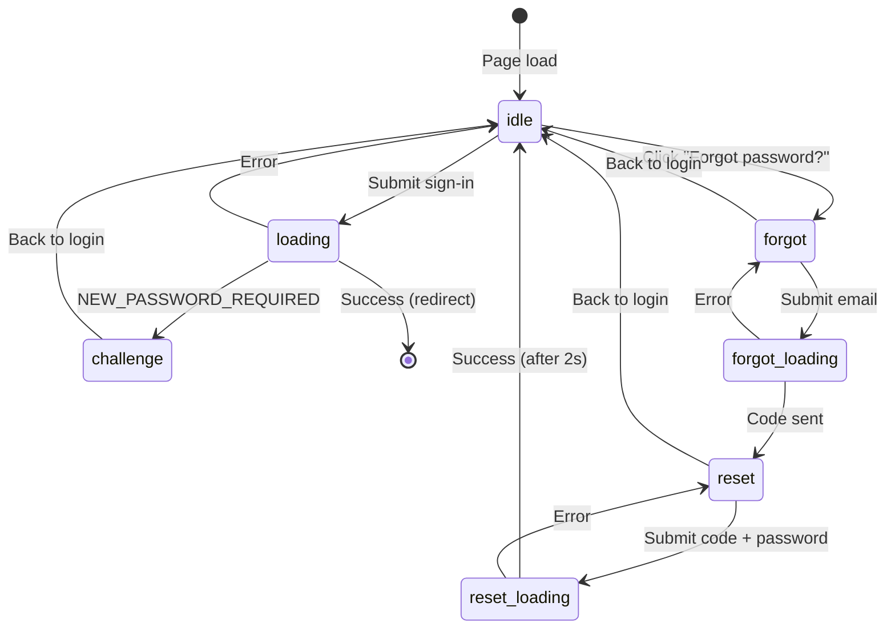

# Design Document: Forgot Password Flow

## Overview

Extends the existing inline Cognito authentication with forgot-password and password-visibility features. Uses the same `cognitoRequest()` helper already in `auth.ts` to call `ForgotPassword` and `ConfirmForgotPassword` API actions. No backend Lambda changes required — all communication is directly between the browser and the Cognito IdP endpoint.

### Key Design Decisions

1. **Client-side only**: The forgot password flow calls Cognito directly from the browser, matching the existing `signIn()` approach. No backend API proxy needed.

2. **Multi-step form state machine**: The login page's state type is extended from 4 states to 8 states (`idle`, `loading`, `challenge`, `challenge-loading`, `forgot`, `forgot-loading`, `reset`, `reset-loading`) to manage the additional screens.

3. **Prevent email enumeration**: If `ForgotPassword` returns `UserNotFoundException`, the handler returns success anyway to avoid leaking whether an email is registered.

4. **Lucide Eye/EyeOff icons**: Reuses the already-installed `lucide-vue-next` library for consistent iconography.

## Architecture

## Auth Module Functions

### `forgotPassword(email: string): Promise<AuthSuccess | AuthError>`

Calls `ForgotPassword` with `{ ClientId, Username }`. Suppresses `UserNotFoundException` to prevent enumeration.

### `confirmForgotPassword(email, code, newPassword): Promise<AuthSuccess | AuthError>`

Calls `ConfirmForgotPassword` with `{ ClientId, Username, ConfirmationCode, Password }`. Maps Cognito errors to user-friendly messages:

| Cognito Error | User Message |
|---------------|-------------|
| `CodeMismatchException` | Invalid verification code. Please try again. |
| `ExpiredCodeException` | Verification code expired. Please request a new one. |
| `InvalidPasswordException` | Password does not meet requirements. |
| `LimitExceededException` | Too many attempts. Please try again later. |

## CSS Components

- `.password-field` — flex container positioning the toggle button over the input
- `.toggle-vis` — absolutely-positioned button with transparent background
- `.forgot-link` — styled link below the sign-in button
- `.form-hint` — secondary text for form instructions
- `.login-form .success` — green success message for reset confirmation
