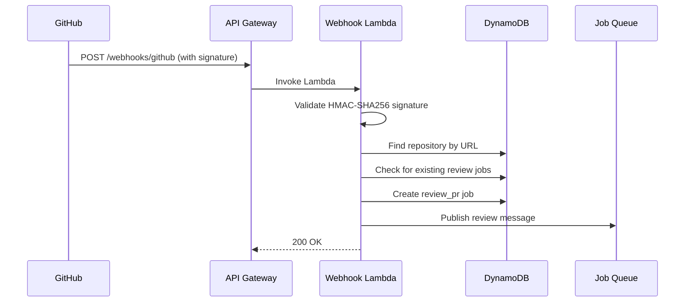

# Design Document: GitHub Webhook Integration

## Overview

A dedicated Lambda function behind API Gateway receives GitHub webhook events, validates signatures, matches repositories, and creates review jobs. The endpoint is public (no Cognito auth) but protected by HMAC-SHA256 signature verification.

### Key Design Decisions

1. **Separate Lambda function**: The webhook handler is a dedicated Lambda (`WebhookFunction`) to isolate it from the authenticated API and give it a minimal IAM role.

2. **Signature-first validation**: The handler validates the webhook signature before parsing the body, rejecting invalid requests early.

3. **Deduplication by PR number**: Before creating a review job, the handler checks if a QUEUED or RUNNING review job already exists for the same repo and PR number.

## Architecture



## Webhook Event Processing

### Supported Events

| GitHub Event | Action | Handler Behavior |
|-------------|--------|-----------------|
| `pull_request` | `opened` | Create review job |
| `pull_request` | `synchronize` | Create review job (new commits pushed) |
| `push` | N/A | Log only (future: auto-trigger feature jobs) |

### Signature Validation

```typescript
function validateWebhookSignature(body: string, signature: string, secret: string): boolean {
  const expected = `sha256=${crypto.createHmac("sha256", secret).update(body).digest("hex")}`;
  return crypto.timingSafeEqual(Buffer.from(signature), Buffer.from(expected));
}
```

## SAM Resources

```yaml
WebhookFunction:
  Type: AWS::Serverless::Function
  Properties:
    FunctionName: !Sub ${StageName}-remote-kiro-webhook
    Handler: packages/backend/src/handlers/webhook.handler
    Environment:
      Variables:
        GITHUB_WEBHOOK_SECRET: !Ref GitHubWebhookSecret
    Events:
      GithubWebhook:
        Type: HttpApi
        Properties:
          Path: /webhooks/github
          Method: POST
          # No auth — public endpoint, validated by signature
```
