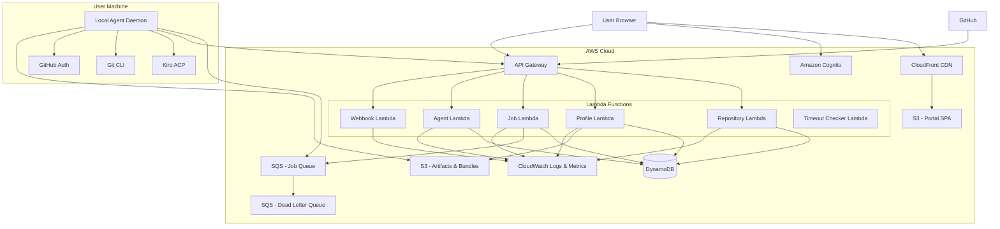
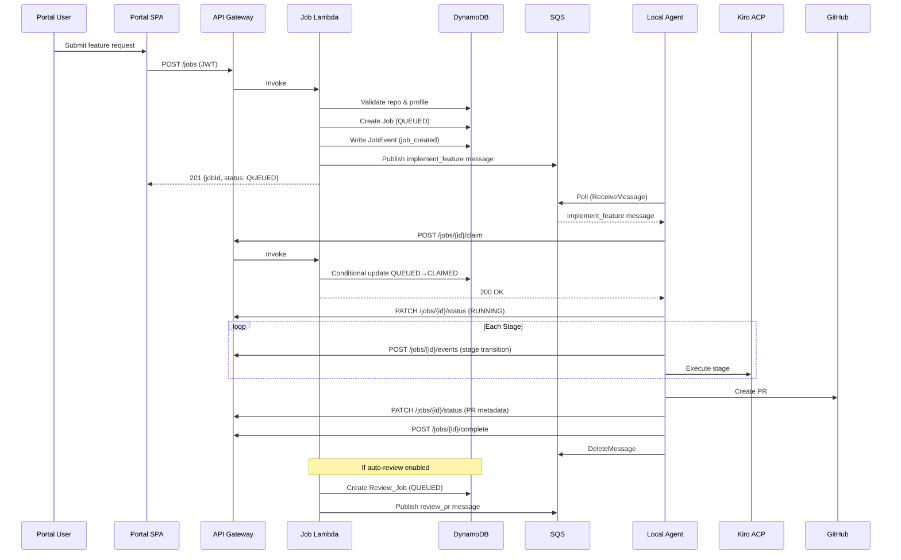
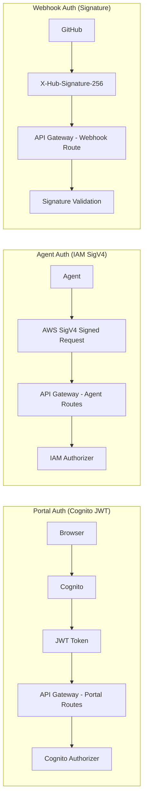
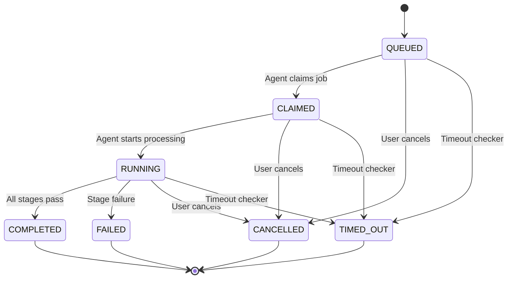
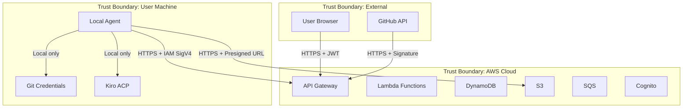

# Design Document: Remote Kiro Coding Assistant

## Overview

The Remote Kiro Coding Assistant is a serverless control-plane that orchestrates coding tasks submitted through a web portal, dispatches them to local execution agents via SQS, and manages the full lifecycle from task submission through PR creation and automated review.

The system is split into three tiers:

1. **Portal** — A Vue.js SPA on S3/CloudFront for user interaction (repo management, job submission, monitoring).
2. **Backend** — API Gateway + Lambda functions backed by DynamoDB and S3, handling REST APIs, auth, state management, and async dispatch via SQS.
3. **Local Agent** — A daemon on a user-controlled machine that polls SQS, executes Kiro ACP and Git operations locally, and reports results back to the Backend.

Key design drivers:
- All cloud components are serverless (no EC2, no containers in the cloud).
- Git credentials and Kiro execution stay local — the cloud never touches code directly.
- Jobs follow a strict state machine with conditional DynamoDB writes to prevent race conditions.
- Config bundles are versioned and immutable in S3, ensuring reproducible execution.
- Automatic PR review is a first-class workflow step, triggered after feature job completion.

## Architecture

### High-Level Architecture Diagram



### Request Flow — Feature Job



### Authentication & Authorization



## Components and Interfaces

### 1. Portal SPA (Vue.js)

Responsibilities:
- Cognito login/logout flow with token management and refresh
- REST API calls to Backend with JWT in Authorization header
- Pages: Login, Dashboard, Repository List/Detail, Profile List, Job Creation, Job Detail, Admin (Bundle Publishing)
- Polling-based refresh for job status (configurable interval, no WebSocket)

Key modules:
- `auth.ts` — Cognito integration, token storage, refresh logic
- `api.ts` — Axios/fetch wrapper with JWT injection, error handling
- `router.ts` — Vue Router with auth guards
- `stores/` — Pinia stores for repositories, profiles, jobs
- `views/` — Page components per Requirement 21

### 2. Backend Lambda Functions

Each Lambda handles a resource domain. All share a common middleware layer for auth validation, request parsing, and structured logging.

| Lambda | Routes | Auth |
|--------|--------|------|
| Repository | POST/GET/PATCH /repositories | Cognito JWT |
| Profile | GET/POST /profiles, POST /profiles/{id}/publish-bundle | Cognito JWT |
| Job | POST/GET /jobs, GET /jobs/{id}, POST /jobs/{id}/cancel, GET /jobs/{id}/events, GET /jobs/{id}/artifacts | Cognito JWT |
| Agent | POST /agents/register, POST /agents/{id}/heartbeat | IAM SigV4 |
| Job Worker | POST /jobs/{id}/claim, PATCH /jobs/{id}/status, POST /jobs/{id}/events, POST /jobs/{id}/artifacts/presign, POST /jobs/{id}/complete, POST /jobs/{id}/fail | IAM SigV4 |
| Webhook | POST /webhooks/github | Signature |
| Timeout Checker | EventBridge scheduled (every 5 min) | Internal |

### 3. DynamoDB Access Layer

A shared data access module used by all Lambdas providing:
- CRUD operations per table with consistent key handling
- Conditional writes for state machine transitions (optimistic concurrency)
- Query patterns for GSI-based lookups (e.g., jobs by user, jobs by status)
- Pagination support for list endpoints

### 4. SQS Publisher

A shared module for publishing job messages to SQS:
- `publishImplementFeature(jobData)` — Publishes `implement_feature` message
- `publishReviewPR(jobData)` — Publishes `review_pr` message
- Message deduplication via jobId as MessageDeduplicationId (if FIFO) or idempotent claim on standard queue

### 5. Local Agent Daemon

Responsibilities:
- Configuration loading and validation (`kiro-cli` on PATH, Git on PATH)
- SQS polling with configurable interval and concurrency limit
- Job processing pipeline (claim → stages → complete/fail)
- Kiro ACP subprocess management (spawn `kiro-cli acp`, JSON-RPC 2.0 over stdin/stdout)
- Network resilience (exponential backoff, local event buffering)
- Heartbeat loop (separate from job processing)
- Bundle caching

Key modules:
- `config.ts` — Load and validate agent config file
- `poller.ts` — SQS long-polling loop with concurrency gating
- `pipeline.ts` — Job processing orchestrator (stage runner)
- `kiro-acp-client.ts` — Kiro ACP client: spawns `kiro-cli acp` subprocess, sends JSON-RPC 2.0 requests over stdin, reads streaming responses from stdout, handles session lifecycle (initialize → session/new → session/prompt)
- `stages/` — Individual stage implementations (validate_repo, prepare_workspace, apply_bundle, run_kiro, run_tests, commit, push, create_pr, finalize)
- `api_client.ts` — Backend API client with retry/backoff
- `heartbeat.ts` — Periodic heartbeat sender
- `bundle_cache.ts` — Download and cache config bundles
- `event_buffer.ts` — Local event buffer for offline resilience

### 6. Webhook Handler

- Validates GitHub webhook signature (HMAC-SHA256 with configured secret)
- Parses push events to identify PR branches
- Deduplicates re-review requests (checks for existing QUEUED/RUNNING review jobs)
- Creates Review_Job and publishes to SQS

### Interface Contracts

#### SQS Message: implement_feature
```json
{
  "messageType": "implement_feature",
  "jobId": "string",
  "jobType": "implement_feature",
  "repoId": "string",
  "repoUrl": "string",
  "baseBranch": "string",
  "workBranch": "string",
  "profileId": "string",
  "bundleVersion": "number",
  "requestedBy": "string",
  "constraints": "string | null",
  "createdAt": "ISO8601"
}
```

#### SQS Message: review_pr
```json
{
  "messageType": "review_pr",
  "jobId": "string",
  "jobType": "review_pr",
  "parentJobId": "string",
  "repoId": "string",
  "repoUrl": "string",
  "baseBranch": "string",
  "workBranch": "string",
  "profileId": "string",
  "bundleVersion": "number",
  "prNumber": "number",
  "prUrl": "string",
  "createdAt": "ISO8601"
}
```

#### REST API Response Envelope
```json
{
  "data": "object | array",
  "pagination": {
    "nextToken": "string | null"
  },
  "error": {
    "code": "string",
    "message": "string"
  }
}
```

## Data Models

### Kiro ACP Protocol Integration

The Local Agent communicates with Kiro via the Agent Control Protocol (ACP), a JSON-RPC 2.0 protocol over stdin/stdout of a `kiro-cli acp` subprocess.

#### ACP Lifecycle

```
1. Spawn: subprocess.Popen(["kiro-cli", "acp"], stdin=PIPE, stdout=PIPE, stderr=PIPE)
2. Initialize: send JSON-RPC request { method: "initialize", params: { protocolVersion, clientCapabilities, clientInfo } }
3. Create Session: send { method: "session/new", params: { cwd: workspacePath, mcpServers: [...] } }
4. Send Prompt: send { method: "session/prompt", params: { sessionId, prompt: [{ type: "text", text: "..." }] } }
5. Stream Updates: read stdout for session/update and session/notification messages
6. Completion: prompt response includes stopReason
7. Teardown: terminate subprocess
```

#### Initialize Request

```json
{
  "jsonrpc": "2.0",
  "id": 1,
  "method": "initialize",
  "params": {
    "protocolVersion": 1,
    "clientCapabilities": {
      "fs": { "readTextFile": true, "writeTextFile": true },
      "terminal": true
    },
    "clientInfo": {
      "name": "remote-kiro-agent",
      "version": "1.0.0"
    }
  }
}
```

#### Session New Request

```json
{
  "jsonrpc": "2.0",
  "id": 2,
  "method": "session/new",
  "params": {
    "cwd": "/path/to/workspace/repo",
    "mcpServers": []
  }
}
```

The `cwd` is set to the Workspace directory where the repo is checked out and the Config_Bundle has been applied to `.kiro/`. The `mcpServers` array can be populated from the Config_Bundle's `settings/mcp.json` if MCP is enabled in the manifest.

#### Session Prompt Request

```json
{
  "jsonrpc": "2.0",
  "id": 3,
  "method": "session/prompt",
  "params": {
    "sessionId": "session_abc",
    "prompt": [
      { "type": "text", "text": "Implement the following feature: ..." }
    ]
  }
}
```

#### Streaming Update Kinds

| Kind | Description |
|------|-------------|
| `AgentMessageChunk` / `agent_message_chunk` | Incremental text output from Kiro (streamed response) |
| `ToolCall` / `tool_call` | Kiro is invoking a tool (file write, shell command, etc.) |
| `ToolCallUpdate` / `tool_call_update` | Progress update for an in-flight tool call |
| `TurnEnd` / `turn_end` | Kiro has finished its current turn |

Updates arrive as `session/update` or `session/notification` JSON-RPC notifications on stdout. The agent captures `AgentMessageChunk` content for transcript logging and monitors `ToolCall` events for progress tracking.

#### Prompt Response

The `session/prompt` response includes a `stopReason` field indicating why Kiro stopped (e.g., task complete, error, tool approval needed). The agent uses this to determine whether the stage succeeded.

#### Error Handling

- If the `kiro-cli acp` subprocess exits unexpectedly, the agent fails the job with error code `KIRO_ACP_CRASH`.
- If a `session/prompt` call times out (configurable, default 20 minutes for feature, 10 minutes for review), the agent terminates the subprocess and fails the job with `KIRO_ACP_TIMEOUT`.
- Stderr output from the subprocess is captured and included in the job failure message.

### DynamoDB Table Designs

#### Repositories Table

| Attribute | Type | Description |
|-----------|------|-------------|
| `repoId` (PK) | String | Unique identifier (UUID) |
| `name` | String | Display name for the repository |
| `url` | String | Git remote URL |
| `provider` | String | Git hosting provider (e.g., `github`) |
| `defaultBranch` | String | Default base branch (e.g., `main`) |
| `defaultFeatureProfileId` | String | Default Execution_Profile for feature jobs |
| `defaultReviewProfileId` | String | Default Execution_Profile for review jobs |
| `autoReviewEnabled` | Boolean | Whether to auto-create Review_Jobs after Feature_Jobs |
| `status` | String | `active` or `archived` |
| `createdBy` | String | Cognito user sub |
| `createdAt` | String | ISO 8601 timestamp |
| `updatedAt` | String | ISO 8601 timestamp |

GSI: `createdBy-index`
- Partition key: `createdBy`
- Sort key: `createdAt`
- Projection: ALL
- Purpose: List repositories for a specific user, sorted by creation date.

#### Profiles Table

| Attribute | Type | Description |
|-----------|------|-------------|
| `profileId` (PK) | String | Unique identifier (UUID) |
| `name` | String | Human-readable profile name |
| `profileType` | String | `feature` or `reviewer` |
| `bundleVersion` | Number | Current active bundle version |
| `bundleS3Key` | String | S3 key of the active Config_Bundle archive |
| `description` | String | Profile description |
| `active` | Boolean | Whether the profile is published and selectable |
| `createdAt` | String | ISO 8601 timestamp |
| `updatedAt` | String | ISO 8601 timestamp |

#### Agents Table

| Attribute | Type | Description |
|-----------|------|-------------|
| `agentId` (PK) | String | Unique identifier (UUID, derived from machine ID) |
| `machineLabel` | String | Human-readable label for the agent machine |
| `capabilities` | List\<String\> | Capability_Tags (e.g., `node`, `python`, `docker`) |
| `workspaceRoot` | String | Absolute path to the agent workspace directory |
| `status` | String | `online` or `offline` |
| `lastHeartbeatAt` | String | ISO 8601 timestamp of last heartbeat |
| `repoAllowlist` | List\<String\> | Repo IDs this agent is allowed to process (empty = all) |
| `maxConcurrentJobs` | Number | Maximum parallel jobs this agent will accept |
| `createdAt` | String | ISO 8601 timestamp |
| `updatedAt` | String | ISO 8601 timestamp |

#### Jobs Table

| Attribute | Type | Description |
|-----------|------|-------------|
| `jobId` (PK) | String | Unique identifier (UUID) |
| `jobType` | String | `implement_feature` or `review_pr` |
| `parentJobId` | String \| null | For Review_Jobs, the originating Feature_Job ID |
| `repoId` | String | Reference to Repositories table |
| `repoUrl` | String | Git remote URL (denormalized for agent convenience) |
| `baseBranch` | String | Target branch for PR |
| `workBranch` | String | Working branch name |
| `title` | String | Job title / feature summary |
| `description` | String | Full feature description or review scope |
| `status` | String | Current state machine status |
| `requestedBy` | String | Cognito user sub |
| `assignedAgentId` | String \| null | Agent that claimed the job |
| `featureProfileId` | String | Execution_Profile used for feature work |
| `reviewProfileId` | String \| null | Execution_Profile used for review |
| `bundleVersion` | Number | Config_Bundle version at time of job creation |
| `prNumber` | Number \| null | GitHub PR number (set after PR creation) |
| `prUrl` | String \| null | GitHub PR URL |
| `commitSha` | String \| null | Head commit SHA |
| `reviewOutcome` | String \| null | `APPROVE`, `REQUEST_CHANGES`, or `COMMENT` |
| `errorCode` | String \| null | Machine-readable error code on failure |
| `errorMessage` | String \| null | Human-readable failure description |
| `createdAt` | String | ISO 8601 timestamp |
| `updatedAt` | String | ISO 8601 timestamp |
| `startedAt` | String \| null | When the agent started processing |
| `completedAt` | String \| null | When the job reached a terminal status |

GSI: `requestedBy-index`
- Partition key: `requestedBy`
- Sort key: `createdAt`
- Projection: ALL
- Purpose: List jobs for a specific user, most recent first.

GSI: `status-index`
- Partition key: `status`
- Sort key: `createdAt`
- Projection: ALL
- Purpose: Query jobs by status (e.g., find all QUEUED jobs for timeout checking).

#### JobEvents Table

| Attribute | Type | Description |
|-----------|------|-------------|
| `jobId` (PK) | String | Reference to Jobs table |
| `eventTs` (SK) | String | ISO 8601 timestamp with microsecond precision |
| `eventType` | String | Event category (e.g., `status_change`, `stage_transition`, `log`, `error`) |
| `message` | String | Human-readable event description |
| `stage` | String \| null | Current stage name at time of event |
| `metadata` | Map | Optional structured data (e.g., `{previousStatus, newStatus}`) |

#### Artifacts Table

| Attribute | Type | Description |
|-----------|------|-------------|
| `jobId` (PK) | String | Reference to Jobs table |
| `artifactId` (SK) | String | Unique artifact identifier (UUID) |
| `artifactType` | String | `log`, `patch`, `review_report`, `transcript`, or `screenshot` |
| `s3Key` | String | S3 object key |
| `contentType` | String | MIME type (e.g., `application/json`, `text/plain`) |
| `createdAt` | String | ISO 8601 timestamp |


## Job State Machine

### Status Values

| Status | Description |
|--------|-------------|
| `QUEUED` | Job created, SQS message published, awaiting agent claim |
| `CLAIMED` | Agent has claimed the job, preparing to start |
| `RUNNING` | Agent is actively processing stages |
| `AWAITING_APPROVAL` | Reserved for future manual approval gates |
| `COMPLETED` | All stages finished successfully |
| `FAILED` | A stage failed or an unrecoverable error occurred |
| `CANCELLED` | User cancelled the job via the Portal |
| `TIMED_OUT` | Job exceeded maximum allowed duration |

### Valid Transitions



### Feature Job Stages

```
VALIDATING_REPO → PREPARING_WORKSPACE → APPLYING_BUNDLE → RUNNING_KIRO → RUNNING_TESTS → COMMITTING → PUSHING → CREATING_PR → FINALIZING
```

| Stage | Description |
|-------|-------------|
| `VALIDATING_REPO` | Verify repo URL is reachable and agent has access |
| `PREPARING_WORKSPACE` | Clone or fetch repo, checkout base branch, create work branch |
| `APPLYING_BUNDLE` | Download Config_Bundle from S3, extract into `.kiro/` directory |
| `RUNNING_KIRO` | Spawn `kiro-cli acp`, initialize session with workspace cwd, send feature prompt, stream updates |
| `RUNNING_TESTS` | Execute validation commands from the bundle (tests, lint, build) |
| `COMMITTING` | Stage and commit all changes with a descriptive message |
| `PUSHING` | Push work branch to remote |
| `CREATING_PR` | Create GitHub PR from work branch to base branch |
| `FINALIZING` | Upload artifacts, report completion to Backend |

### Review Job Stages

```
FETCHING_PR → PREPARING_DIFF → RUNNING_REVIEW → POSTING_REVIEW → SETTING_STATUS → FINALIZING
```

| Stage | Description |
|-------|-------------|
| `FETCHING_PR` | Fetch latest PR refs and metadata from GitHub |
| `PREPARING_DIFF` | Generate diff between PR branch and base branch |
| `RUNNING_REVIEW` | Spawn `kiro-cli acp`, initialize session with workspace cwd, send review prompt with diff |
| `POSTING_REVIEW` | Post review findings as GitHub PR review with inline comments |
| `SETTING_STATUS` | Set commit status/check on PR head with `kiro-review` context |
| `FINALIZING` | Upload review artifacts, report completion to Backend |

### Conditional Write Strategy

All status transitions use DynamoDB conditional expressions to prevent race conditions:

```
ConditionExpression: "#status = :expectedStatus"
```

This ensures:
- Only one agent can claim a QUEUED job (QUEUED → CLAIMED).
- A cancelled job cannot be moved to COMPLETED by a late-arriving agent update.
- Concurrent timeout checks and agent completions resolve deterministically — the first writer wins.

If a conditional write fails with `ConditionalCheckFailedException`, the caller receives HTTP 409 and must re-read the current state before deciding next steps.


## Security Design

### Authentication Mechanisms

| Mechanism | Scope | Implementation |
|-----------|-------|----------------|
| Cognito JWT | Portal → Backend API | API Gateway Cognito Authorizer validates JWT on every request. User sub extracted from token claims for ownership checks. |
| IAM SigV4 | Agent → Backend API | API Gateway IAM Authorizer validates AWS SigV4 signatures. The agent uses the same IAM role for both SQS polling and API Gateway calls. IAM policy scopes access to agent-specific routes. |
| Webhook Signature | GitHub → Backend | Webhook Lambda validates `X-Hub-Signature-256` header using HMAC-SHA256 with the configured webhook secret. |

### Transport Security

- All API Gateway endpoints enforce HTTPS-only. HTTP requests are rejected.
- The Local Agent communicates with the Backend exclusively over HTTPS.
- S3 presigned URLs are generated with HTTPS scheme.

### Credential Isolation

- Git credentials (SSH keys, PATs, credential helpers) exist only on the agent machine and are never transmitted to the Backend.
- GitHub tokens for PR operations are configured locally on the agent and never stored in DynamoDB or S3.
- The Backend has zero access to repository contents — it only stores metadata.

### Presigned URL Scoping

- S3 presigned upload URLs are scoped to a specific `jobs/{jobId}/artifacts/{artifactId}` prefix.
- Presigned URLs expire after 15 minutes.
- Presigned download URLs are generated on-demand per artifact request and expire after 60 minutes.

### Trust Boundaries



Key trust boundary rules:
- Cloud components never cross into the agent trust boundary (no SSH, no remote exec).
- Agent authenticates to cloud via IAM SigV4 (same role for SQS and API Gateway), to GitHub via local credentials.
- Webhook payloads are validated at the boundary before any processing.


## Observability

### CloudWatch Logs

- All Lambda functions emit structured JSON logs to CloudWatch Logs.
- Every log entry includes `jobId` when processing a job-related request.
- Log fields: `timestamp`, `level`, `lambdaName`, `requestId`, `jobId`, `message`, `metadata`.
- Log retention: 30 days (configurable via infrastructure).

### CloudWatch Metrics

| Metric | Namespace | Dimensions | Description |
|--------|-----------|------------|-------------|
| `JobCreatedCount` | `RemoteKiro` | `jobType` | Incremented when a job is created |
| `JobCompletedCount` | `RemoteKiro` | `jobType` | Incremented when a job completes |
| `JobFailedCount` | `RemoteKiro` | `jobType` | Incremented when a job fails |
| `JobDuration` | `RemoteKiro` | `jobType` | Elapsed time from RUNNING to terminal status (seconds) |
| `QueueDepth` | `RemoteKiro` | `queueName` | Approximate number of messages in the job queue |
| `DLQMessageCount` | `RemoteKiro` | `queueName` | Number of messages in the dead letter queue |

### S3 Artifact Storage

- Execution logs are uploaded as artifacts with type `log` after job completion or failure.
- Artifact key pattern: `artifacts/{jobId}/{artifactId}/{filename}`
- Bundle key pattern: `bundles/{profileId}/v{version}/bundle.zip`
- S3 lifecycle policy: artifacts older than 90 days transition to Glacier (configurable).

### Local Agent Logging

- The agent writes structured logs to `{logDir}/{jobId}.log` during job execution.
- A main agent log at `{logDir}/agent.log` captures polling, heartbeat, and lifecycle events.
- Log rotation is handled by the host OS or agent configuration.
- On job completion or failure, the job-specific log file is uploaded as an artifact.


## Correctness Properties

*A property is a characteristic or behavior that should hold true across all valid executions of a system — essentially, a formal statement about what the system should do. Properties serve as the bridge between human-readable specifications and machine-verifiable correctness guarantees.*

### Property 1: State machine transition integrity

*For any* job in status S and any requested target status T, the transition should succeed if and only if (S, T) is in the valid transition set {(QUEUED, CLAIMED), (CLAIMED, RUNNING), (RUNNING, COMPLETED), (RUNNING, FAILED), (QUEUED, CANCELLED), (CLAIMED, CANCELLED), (RUNNING, CANCELLED), (QUEUED, TIMED_OUT), (CLAIMED, TIMED_OUT), (RUNNING, TIMED_OUT)}. All other transitions should be rejected with HTTP 409.

**Validates: Requirements 15.1, 15.2**

### Property 2: Conditional write prevents concurrent claims

*For any* job in QUEUED status and any two concurrent claim requests, exactly one should succeed (transitioning to CLAIMED) and the other should fail with HTTP 409. The job should never be claimed by two agents simultaneously.

**Validates: Requirements 15.3, 6.2, 6.3**

### Property 3: Job creation produces consistent artifacts

*For any* valid job submission (valid repoId, valid profileId, valid description), the system should produce exactly three side effects: a Job record in DynamoDB with status QUEUED, an SQS message with matching jobId and metadata, and a Job_Event with type `job_created`.

**Validates: Requirements 5.1, 5.2, 5.6**

### Property 4: Job creation rejects invalid references

*For any* job submission where the repoId does not reference an active repository or the profileId does not reference a published profile, the request should be rejected with HTTP 400 and no Job record, SQS message, or Job_Event should be created.

**Validates: Requirements 5.3, 5.4, 5.5, 3.5**

### Property 5: Repository record completeness

*For any* created repository, the record should contain all required fields: repoId, url, defaultBranch, defaultFeatureProfileId, autoReviewEnabled, status (active), and createdBy. Retrieving the repository via GET should return the same values that were provided during creation.

**Validates: Requirements 2.1, 2.2, 2.3, 2.4, 2.5**

### Property 6: Repository URL uniqueness per user

*For any* user and any repository URL that is already registered for that user, a second POST /repositories with the same URL should be rejected with HTTP 409.

**Validates: Requirements 2.7**

### Property 7: Repository update round-trip

*For any* repository and any valid update payload (defaultBranch, defaultProfile, autoReviewEnabled), after PATCH the subsequent GET should return the updated values, and all non-updated fields should remain unchanged.

**Validates: Requirements 2.6**

### Property 8: Profile role invariant

*For any* created Execution_Profile, the profileType field must be either `feature` or `reviewer`, and the record must contain a bundleVersion and bundleS3Key referencing a valid Config_Bundle.

**Validates: Requirements 3.3, 3.4**

### Property 9: Bundle version monotonicity

*For any* sequence of Config_Bundle publishes to the same profileId, the version numbers should be strictly monotonically increasing. After publishing version N, the profile's active bundleVersion should equal N, and all versions 1 through N should remain accessible in S3.

**Validates: Requirements 4.1, 4.2, 4.5**

### Property 10: Bundle manifest validation

*For any* Config_Bundle archive that does not contain a `manifest.json` file, the publish request should be rejected with HTTP 400. For any archive that does contain `manifest.json`, the upload should succeed (assuming no other validation failures).

**Validates: Requirements 4.3, 4.4**

### Property 11: Bundle security validation

*For any* Config_Bundle archive containing executable hooks or MCP server definitions that reference external network endpoints outside the local machine, the publish request should be rejected.

**Validates: Requirements 4.6**

### Property 12: Unauthenticated portal requests are rejected

*For any* API Gateway portal endpoint and any request that does not include a valid Cognito JWT token, the response should be HTTP 401.

**Validates: Requirements 1.3, 19.5**

### Property 13: Unauthenticated agent requests are rejected

*For any* API Gateway agent endpoint and any request that does not include a valid IAM SigV4 signature, the response should be HTTP 403.

**Validates: Requirements 10.5, 19.6**

### Property 14: Invalid webhook signatures are rejected

*For any* webhook request where the `X-Hub-Signature-256` header does not match the HMAC-SHA256 of the request body with the configured secret, the response should be HTTP 401.

**Validates: Requirements 9.2, 9.3, 19.7**

### Property 15: Feature job stage ordering

*For any* completed Feature_Job, the Job_Events for stage transitions should appear in strictly the order: VALIDATING_REPO, PREPARING_WORKSPACE, APPLYING_BUNDLE, RUNNING_KIRO, RUNNING_TESTS, COMMITTING, PUSHING, CREATING_PR, FINALIZING.

**Validates: Requirements 6.5, 6.6**

### Property 16: SQS message lifecycle

*For any* job processed by the Local_Agent, the SQS message should be deleted if and only if the job has reached a terminal status (COMPLETED, FAILED, or CANCELLED). If a claim fails with HTTP 409 (duplicate delivery), the message should also be deleted without performing work.

**Validates: Requirements 6.17, 6.18, 16.2, 16.3**

### Property 17: Idempotent claim — no duplicate work

*For any* SQS message received by the Local_Agent, if the claim request returns HTTP 409, the agent should perform zero stage processing and delete the message. No side effects (Git operations, Kiro invocations, events) should occur.

**Validates: Requirements 16.1, 16.2**

### Property 18: Auto-review triggering

*For any* Feature_Job that reaches COMPLETED status where the associated Repository has `autoReviewEnabled = true`, the Backend should create a Review_Job with the correct parentJobId, PR metadata, and the repository's default reviewer profile, and publish a `review_pr` SQS message.

**Validates: Requirements 7.1, 7.2, 7.3, 7.4**

### Property 19: Review deduplication

*For any* PR that already has a QUEUED or RUNNING Review_Job, a new webhook push event for the same PR branch should not create an additional Review_Job.

**Validates: Requirements 9.4**

### Property 20: Cancellation from non-terminal statuses

*For any* job in QUEUED, CLAIMED, or RUNNING status, a cancel request should transition the job to CANCELLED and record a Job_Event. For any job in a terminal status (COMPLETED, FAILED, CANCELLED, TIMED_OUT), a cancel request should be rejected with HTTP 409.

**Validates: Requirements 11.1, 11.2, 11.4**

### Property 21: Job event round-trip and ordering

*For any* sequence of Job_Events posted for a jobId, retrieving events via GET /jobs/{jobId}/events should return all posted events in chronological order, each containing eventType, stage, message, and metadata.

**Validates: Requirements 13.1, 13.2, 13.3**

### Property 22: Status transition events

*For any* status transition on a job, a system-generated Job_Event should be recorded containing the previousStatus and newStatus in its metadata.

**Validates: Requirements 13.4, 15.4**

### Property 23: Artifact round-trip

*For any* artifact uploaded via presigned URL and recorded via the Backend API, retrieving GET /jobs/{jobId}/artifacts should include that artifact with its type, filename, and a valid presigned download URL scoped to the correct S3 key.

**Validates: Requirements 12.2, 12.3, 12.4**

### Property 24: Job list filtering and ordering

*For any* user with multiple jobs, GET /jobs should return jobs in reverse chronological order. When filtered by status, all returned jobs should have the specified status and no jobs with other statuses should appear.

**Validates: Requirements 14.1, 14.2**

### Property 25: Job timeout enforcement

*For any* job that has been in RUNNING status longer than its configured maximum duration, the timeout checker should transition it to TIMED_OUT and record a Job_Event.

**Validates: Requirements 18.2**

### Property 26: Agent retry with exponential backoff

*For any* Backend API call from the Local_Agent that fails with a network error or HTTP 5xx, the agent should retry up to 3 times with exponentially increasing delays before treating the call as failed.

**Validates: Requirements 17.1**

### Property 27: Event buffering during outage

*For any* sequence of Job_Events generated while the Backend is unreachable, all events should be buffered locally and flushed in order when connectivity is restored. No events should be lost.

**Validates: Requirements 17.3**

### Property 28: Agent concurrency limit

*For any* agent configured with maxConcurrentJobs = N, when N jobs are currently being processed, the agent should not poll for additional SQS messages until a slot becomes available.

**Validates: Requirements 23.5**

### Property 29: Agent repo allowlist enforcement

*For any* agent with a configured repo allowlist, when the agent receives a job for a repository not in the allowlist, the agent should skip the job without processing it.

**Validates: Requirements 23.6**

### Property 30: Config bundle extraction round-trip

*For any* Config_Bundle, after the Local_Agent extracts it into the workspace `.kiro/` directory, the directory contents should match the bundle contents. The bundle version in the workspace should match the version specified in the job message.

**Validates: Requirements 24.1, 24.3**

### Property 31: Config layer precedence

*For any* configuration key present in both the machine global config (`~/.kiro/`) and the workspace Config_Bundle, the workspace value from the bundle should take precedence.

**Validates: Requirements 24.4**

### Property 32: Agent config parsing round-trip

*For any* valid agent configuration file, parsing the file should produce a config object containing all required fields (machineId, machineLabel, capabilities, repoAllowlist, workspaceRoot, pollingInterval, maxConcurrentJobs, bundleCacheDir), and serializing that object back should preserve all values.

**Validates: Requirements 23.1**

### Property 33: PR title derived from feature description

*For any* feature description, the PR title created by the Local_Agent should be a summary derived from that description, and the PR body should contain the full feature description and constraints.

**Validates: Requirements 25.2**

### Property 34: Review state matches severity

*For any* review with findings, the review state posted to GitHub (APPROVE, REQUEST_CHANGES, or COMMENT) should correspond to the severity of the findings.

**Validates: Requirements 25.3**


## Error Handling

### Backend Error Handling

| Error Scenario | HTTP Status | Error Code | Behavior |
|----------------|-------------|------------|----------|
| Missing/invalid JWT token | 401 | `UNAUTHORIZED` | API Gateway Cognito authorizer rejects before Lambda |
| Missing/invalid IAM SigV4 signature | 403 | `FORBIDDEN` | API Gateway IAM authorizer rejects before Lambda |
| Invalid webhook signature | 401 | `INVALID_SIGNATURE` | Webhook Lambda rejects after HMAC validation |
| Resource not found (repo, profile, job) | 404 | `NOT_FOUND` | Lambda returns after DynamoDB lookup |
| Duplicate repository URL for user | 409 | `DUPLICATE_RESOURCE` | Lambda checks GSI before write |
| Invalid state transition | 409 | `INVALID_TRANSITION` | Conditional write fails, Lambda returns current status |
| Concurrent claim race | 409 | `ALREADY_CLAIMED` | Conditional write fails |
| Cancel on terminal job | 409 | `INVALID_TRANSITION` | Lambda checks current status |
| Invalid job references (repoId/profileId) | 400 | `INVALID_REFERENCE` | Lambda validates before creating job |
| Missing manifest.json in bundle | 400 | `INVALID_BUNDLE` | Lambda validates archive contents |
| Bundle with external network refs | 400 | `UNSAFE_BUNDLE` | Lambda scans bundle manifest |
| Request body validation failure | 400 | `VALIDATION_ERROR` | Lambda validates request schema |
| DynamoDB throttling | 500 | `INTERNAL_ERROR` | Lambda retries with SDK backoff, returns 500 if exhausted |
| SQS publish failure | 500 | `INTERNAL_ERROR` | Lambda retries, job stays in DB but message may be missing |

All error responses follow the standard envelope:
```json
{
  "error": {
    "code": "ERROR_CODE",
    "message": "Human-readable description"
  }
}
```

### Local Agent Error Handling

| Error Scenario | Behavior |
|----------------|----------|
| Kiro ACP not available | Log error, exit with non-zero code |
| Git not on PATH | Log error, exit with non-zero code |
| Claim returns 409 | Delete SQS message, skip job |
| Stage failure | Call POST /jobs/{id}/fail with stage and error, delete SQS message |
| GitHub auth failure | Fail job with `GITHUB_AUTH_ERROR` |
| Kiro ACP subprocess crash | Fail job with `KIRO_ACP_CRASH`, include stderr output |
| Kiro ACP prompt timeout | Terminate subprocess, fail job with `KIRO_ACP_TIMEOUT` |
| Network error on API call | Retry with exponential backoff (3 attempts) |
| Network error on SQS poll | Wait polling interval, retry |
| Backend unreachable during job | Buffer events locally, continue processing, flush on reconnect |
| Job cancelled mid-processing | Stop at next stage boundary, delete SQS message |
| Local timeout exceeded | Self-terminate job, call fail endpoint |
| Bundle version mismatch | Fail job with `BUNDLE_VERSION_MISMATCH` |
| Repo not in allowlist | Skip job, leave message for redelivery to another agent |

### SQS Failure Handling

- Messages that fail processing 3 times are moved to the Dead Letter Queue.
- A DLQ monitor (CloudWatch alarm) alerts operators when messages arrive.
- A Job_Event is recorded for DLQ transfers when detectable.
- DLQ messages can be replayed manually after investigation.


## Testing Strategy

### Dual Testing Approach

The system uses both unit tests and property-based tests for comprehensive coverage.

- **Unit tests** verify specific examples, edge cases, integration points, and error conditions.
- **Property-based tests** verify universal properties across randomly generated inputs.

Both are complementary: unit tests catch concrete bugs at known boundaries, property tests verify general correctness across the input space.

### Property-Based Testing Configuration

- **Library**: [fast-check](https://github.com/dubzzz/fast-check) for TypeScript/JavaScript
- **Minimum iterations**: 100 per property test
- **Tagging**: Each property test includes a comment referencing the design property:
  ```
  // Feature: remote-kiro-assistant, Property 1: State machine transition integrity
  ```
- Each correctness property is implemented by a single property-based test.

### Unit Test Focus Areas

- Specific API request/response examples for each endpoint
- DynamoDB conditional write failure scenarios
- SQS message serialization/deserialization
- Config file parsing with valid and invalid inputs
- Bundle archive validation (manifest present/absent, unsafe content)
- Presigned URL generation with correct scoping
- Webhook signature validation with known test vectors
- Agent startup validation (CLI checks)
- Error response format consistency

### Property Test Focus Areas

- State machine transition validity (Property 1)
- Concurrent claim resolution (Property 2)
- Job creation side-effect consistency (Property 3)
- Input validation rejection (Properties 4, 10, 11, 12, 13, 14)
- Data round-trips: repository CRUD (Properties 5, 7), profile CRUD (Property 8), events (Property 21), artifacts (Property 23), config parsing (Property 32)
- Bundle version ordering (Property 9)
- Stage ordering invariant (Property 15)
- SQS message lifecycle (Properties 16, 17)
- Auto-review triggering logic (Properties 18, 19)
- Cancellation logic (Property 20)
- Job list filtering and ordering (Property 24)
- Timeout enforcement (Property 25)
- Retry behavior (Property 26)
- Event buffering (Property 27)
- Concurrency limiting (Property 28)
- Allowlist enforcement (Property 29)
- Config layer precedence (Property 31)

### Integration Test Areas

- End-to-end job submission → claim → stage processing → completion flow
- Auto-review triggering after feature job completion
- Webhook → review job creation pipeline
- Agent registration → heartbeat → offline detection
- Bundle publish → download → extraction → Kiro execution
- Presigned URL upload → artifact retrieval
- Concurrent agent claims on the same job
- Job cancellation while agent is mid-processing
- Timeout checker firing while agent is processing
