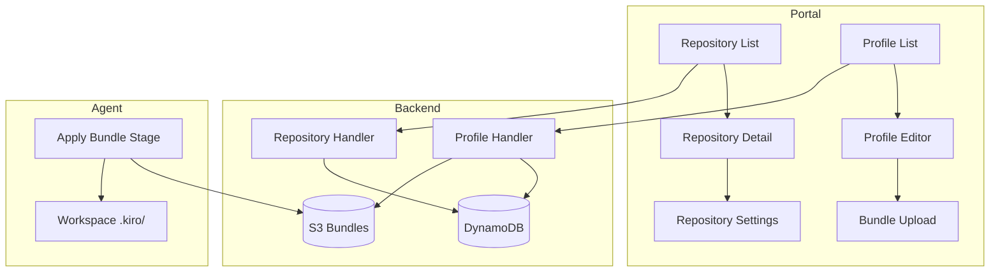

# Design Document: Repository & Profile Management

## Overview

Repositories and profiles form the configuration layer of the system. Repositories track Git sources and their policies. Profiles define Kiro behavior via config bundles stored in S3. Both use the DynamoDB single-table pattern and are managed through dedicated portal pages and backend Lambda handlers.

### Key Design Decisions

1. **Single-table DynamoDB**: Repositories use `PK=REPO#{repoId}, SK=CONFIG`. Profiles use `PK=PROFILE#{profileId}, SK=CONFIG`. Git credentials use `PK=REPO#{repoId}, SK=GIT_CRED`.

2. **S3 for config bundles**: Bundles are stored at `bundles/{profileId}/v{version}/bundle.tar.gz` in the artifacts S3 bucket. The agent downloads the bundle and extracts it to the workspace `.kiro/` directory.

3. **Separate Lambda handlers**: Repositories and profiles each have their own Lambda function to keep handler size manageable and enable independent scaling.

## Architecture



## Data Model

### Repository Record
```
PK: REPO#{repoId}
SK: CONFIG
GSI1PK: REPO_LIST
GSI1SK: REPO#{repoId}
Attributes: repoId, name, url, provider, defaultBranch, defaultFeatureProfileId,
            defaultReviewProfileId, autoReviewEnabled, mcpServers[], status, createdBy
```

### Profile Record
```
PK: PROFILE#{profileId}
SK: CONFIG
GSI1PK: PROFILE_LIST
GSI1SK: PROFILE#{profileId}
Attributes: profileId, name, description, systemPrompt, manifest, bundleVersion,
            createdBy, createdAt, updatedAt
```

### Git Credential Record
```
PK: REPO#{repoId}
SK: GIT_CRED
Attributes: repoId, credentialType, credentials (encrypted)
```

## API Endpoints

### Repositories
| Method | Path | Description |
|--------|------|-------------|
| GET | `/repositories` | List all repositories |
| GET | `/repositories/{id}` | Get repository details |
| POST | `/repositories` | Register a new repository |
| PATCH | `/repositories/{id}` | Update repository settings |
| GET | `/repositories/{id}/credentials` | Agent fetches Git credentials |
| PUT | `/repositories/{id}/credentials` | Set Git credentials |

### Profiles
| Method | Path | Description |
|--------|------|-------------|
| GET | `/profiles` | List all profiles |
| GET | `/profiles/{id}` | Get profile details |
| POST | `/profiles` | Create a new profile |
| PUT | `/profiles/{id}` | Update profile settings |
| POST | `/profiles/{id}/bundle` | Upload config bundle (returns presigned URL) |

## Bundle Lifecycle

1. User uploads bundle via portal → backend returns presigned S3 PUT URL
2. Portal uploads bundle archive to S3 directly
3. Backend increments `bundleVersion` on the profile record
4. When a job starts, the agent downloads the bundle from S3
5. Agent extracts bundle to workspace `.kiro/` directory
6. Kiro ACP reads the config from the workspace
