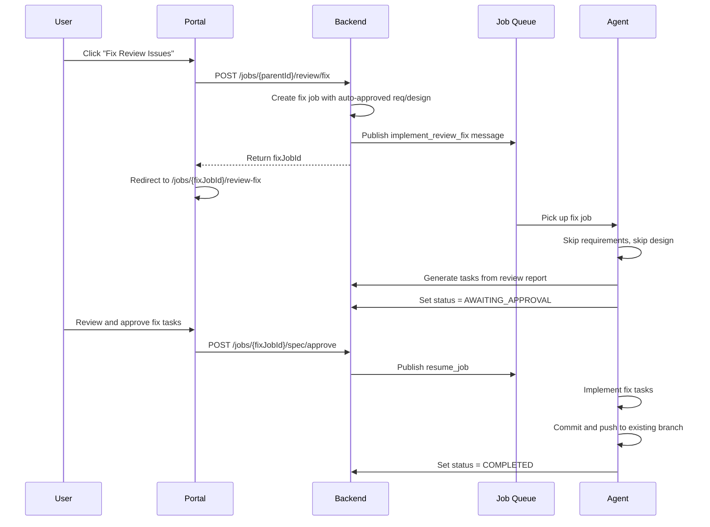

# Design Document: Review Fix Pipeline

## Overview

The review fix pipeline extends the existing job system to handle post-review fixes. A new job type `implement_review_fix` is created as a child of the original feature job. The agent pipeline is modified to skip requirements/design phases and generate tasks directly from the review report. The portal gets a dedicated two-panel page for managing fix jobs.

### Key Design Decisions

1. **Child job linked via `parentJobId`**: Fix jobs reference the parent feature job to inherit repo, branch, and PR context. The parent job gets an event recording the fix job creation.

2. **Skip requirements/design**: Fix jobs auto-approve requirements and design phases and start the agent at the tasks phase. This avoids unnecessary approval cycles since the review report already defines what needs fixing.

3. **Push to existing branch, no new PR**: The agent pushes fix commits to the same work branch, updating the existing PR automatically.

4. **Dedicated UI page**: Rather than overloading the generic JobDetailPage, a dedicated `ReviewFixPage.vue` with a two-panel layout (findings + tasks) provides better UX.

## Architecture



## Agent Pipeline (Review Fix)

```
VALIDATING_REPO → PREPARING_WORKSPACE → APPLYING_BUNDLE
  → GENERATING_TASKS (from review report) → AWAITING_TASKS_APPROVAL
  → IMPLEMENTING_TASKS → RUNNING_TESTS → COMMITTING → PUSHING → UPDATING_PR → FINALIZING
```

Key differences from feature pipeline:
- No GENERATING_REQUIREMENTS, AWAITING_REQUIREMENTS_APPROVAL, GENERATING_DESIGN, or AWAITING_DESIGN_APPROVAL stages
- CREATING_PR replaced with UPDATING_PR (no new PR created)
- Task generation prompt includes the review report as primary context

## API Endpoint

| Method | Path | Description |
|--------|------|-------------|
| POST | `/jobs/{jobId}/review/fix` | Create a review fix child job for the given parent feature job |

## Data Flow

1. Backend creates fix job with `parentJobId` set, auto-approved requirements/design, `specPhase=tasks`
2. Backend emits event on parent job: `{ action: "review_fix_created", fixJobId }`
3. Agent receives `implement_review_fix` SQS message containing `reviewReport` and `prNumber`
4. Agent generates tasks using review report as input context
5. User approves tasks via portal
6. Agent implements tasks, commits, and pushes to existing branch
7. Parent job UI polls for fix job status and shows "Fixes Applied" badge on completion
