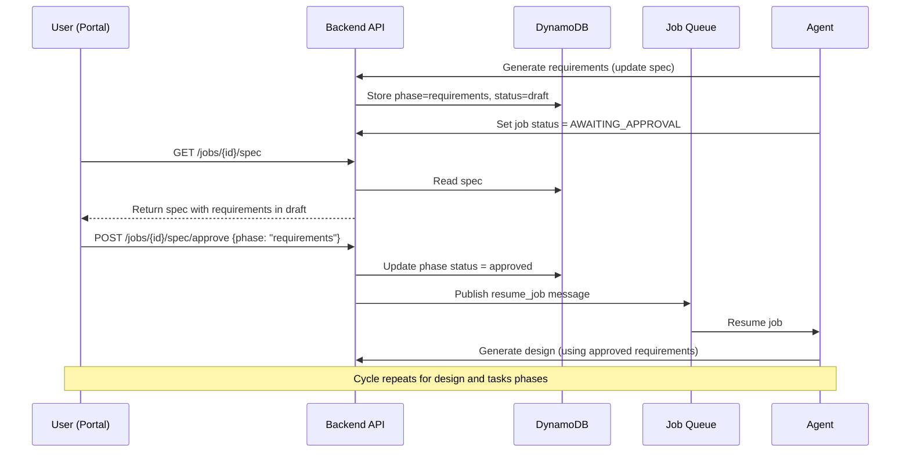

# Design Document: Spec-Driven Workflow

## Overview

The spec-driven workflow introduces a structured approval loop between the user and the agent before any code is written. The agent generates a three-phase specification (requirements → design → tasks), each persisted in DynamoDB and surfaced in the portal UI for review. The user approves, rejects, or provides feedback on each phase. Only after all three phases are approved does the agent proceed to code implementation.

### Key Design Decisions

1. **Single DynamoDB record per spec**: The entire spec (all three phases) is stored as a single item keyed by `PK=JOB#{jobId}, SK=SPEC`. This avoids cross-item transactions and enables atomic reads of the full spec state.

2. **Status-driven state machine**: Each phase has an independent status (`pending` → `generating` → `draft` → `approved` | `rejected`). The `currentPhase` pointer tracks which phase the agent is working on.

3. **Resume via SQS**: When the user approves or rejects a phase, the backend publishes a `resume_job` message to SQS rather than directly calling the agent. This preserves the decoupled architecture.

4. **Kiro ACP for generation**: Each phase is generated by sending a structured prompt to Kiro ACP with the job context, approved prior phases, and any rejection feedback. The agent parses the structured output into spec items.

## Architecture



## Data Model

### Spec Record (DynamoDB)

```
PK: JOB#{jobId}
SK: SPEC
Attributes:
  jobId: string
  currentPhase: "requirements" | "design" | "tasks"
  phases:
    requirements: { phase, status, items[], generatedAt, approvedAt, rejectionReason, revision }
    design:       { phase, status, items[], generatedAt, approvedAt, rejectionReason, revision }
    tasks:        { phase, status, items[], generatedAt, approvedAt, rejectionReason, revision }
  updatedAt: ISO timestamp
```

### SpecItem Schema

```typescript
interface SpecItem {
  id: string;           // e.g., "REQ-1", "DESIGN-1", "TASK-1"
  content: string;      // Markdown content
  completed?: boolean;  // For tasks phase — tracked during implementation
  taskStatus?: "pending" | "in_progress" | "completed" | "failed";
}
```

## API Endpoints

| Method | Path | Description |
|--------|------|-------------|
| GET | `/jobs/{jobId}/spec` | Retrieve the full spec for a job |
| POST | `/jobs/{jobId}/spec/approve` | Approve the current draft phase |
| POST | `/jobs/{jobId}/spec/reject` | Reject the current draft phase with reason |
| POST | `/jobs/{jobId}/spec/messages` | Send feedback on a draft phase (auto-rejects and regenerates) |
| PATCH | `/jobs/{jobId}/spec/items` | Update individual spec item content |
| PUT | `/jobs/{jobId}/spec` | Agent upserts the full spec (used during generation) |

## Agent Pipeline Integration

The feature implementation pipeline adds three stages before task implementation:

```
VALIDATING_REPO → PREPARING_WORKSPACE → APPLYING_BUNDLE
  → GENERATING_REQUIREMENTS → AWAITING_REQUIREMENTS_APPROVAL
  → GENERATING_DESIGN → AWAITING_DESIGN_APPROVAL
  → GENERATING_TASKS → AWAITING_TASKS_APPROVAL
  → IMPLEMENTING_TASKS → RUNNING_TESTS → COMMITTING → PUSHING → CREATING_PR → FINALIZING
```

The `generate-spec` stage uses Kiro ACP to produce structured output. It sends a prompt containing the job description, repository file tree, and any prior approved phases. The output is parsed into `SpecItem[]` and stored via the backend API.

The `await-approval` stage polls `GET /jobs/{jobId}/spec` every 5 seconds, checking if the current phase status has changed from `draft` to `approved` or `rejected`.

## Portal UI Components

The spec viewer is rendered within `JobDetailPage.vue` as a tabbed panel:

- **Tab bar**: Three tabs (Requirements, Design, Tasks) with status badges
- **Active tab content**: Rendered markdown for requirements/design, checklist for tasks
- **Action bar**: Approve/Reject buttons and feedback input (visible only for `draft` phases)
- **Auto-advance**: After approving a phase, the UI switches to the next tab
- **Live updates**: During implementation, task statuses update via polling
