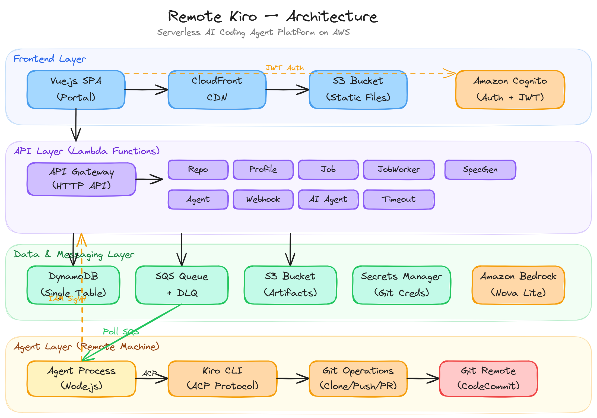
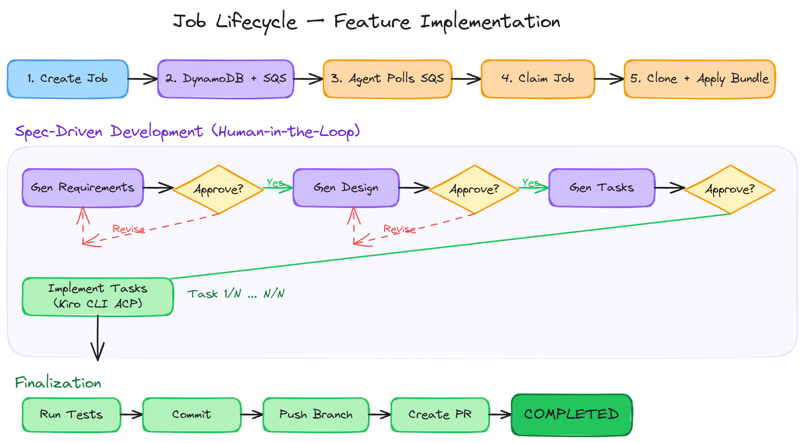

# Remote Kiro Coding Assistant

A serverless control-plane that dispatches AI coding tasks to local agents, manages job lifecycles through a structured approval workflow, and hosts a web portal for monitoring and management. Built entirely on AWS serverless services with TypeScript throughout.

## Architecture



### Three-Tier Architecture

| Tier | Technology | Purpose |
|------|-----------|---------|
| **Portal** | Vue 3 SPA on S3/CloudFront | User interface for job management, spec approval, and monitoring |
| **Backend** | API Gateway + Lambda + DynamoDB | REST APIs, job state machine, async dispatch via SQS |
| **Agent** | Local Node.js daemon | Polls SQS, runs Kiro ACP, performs Git ops, reports back to backend |

### Data Flow

1. User creates a job via the Portal
2. Backend stores the job in DynamoDB and publishes a message to SQS
3. Local Agent polls SQS, picks up the job, and runs the pipeline
4. Agent generates a spec (requirements → design → tasks), each requiring user approval
5. After approval, the agent implements tasks using Kiro ACP
6. Agent commits, pushes, and creates a PR
7. Optionally, a review job is triggered to review the PR

## Packages

| Package | Path | Description |
|---------|------|-------------|
| **common** | `packages/common` | Shared TypeScript types, enums, message schemas, and constants |
| **backend** | `packages/backend` | Lambda handlers, DynamoDB operations, SQS publisher, auth middleware |
| **agent** | `packages/agent` | SQS poller, job pipeline, stage runners, Kiro ACP client, event buffer |
| **portal** | `packages/portal` | Vue 3 SPA with Pinia stores, Cognito auth, job monitoring UI |

## Features

### Core Job Pipeline

- **Feature Implementation** (`implement_feature`) — Clone repo → apply config bundle → spec workflow (requirements → design → tasks with approval) → implement tasks → test → commit → push → create PR
- **Code Review** (`review_pr`) — Fetch PR → generate diff → run Kiro review → post review to GitHub → set commit status
- **Review Fix** (`implement_review_fix`) — Generate fix tasks from review findings → approve tasks → implement fixes → push to existing PR

### Spec-Driven Workflow

Human-in-the-loop approval process before code is written:
1. **Requirements** — Agent generates requirements from the job description; user approves or rejects
2. **Design** — Agent generates design using approved requirements; user approves or rejects
3. **Tasks** — Agent generates implementation tasks; user approves or rejects
4. After all three phases are approved, the agent implements the tasks

Each phase supports approval, rejection with reason, and feedback-driven revision.

### Authentication & User Management

- Inline Cognito login (no hosted UI redirect) with `USER_PASSWORD_AUTH` flow
- Auth challenge handling (NEW_PASSWORD_REQUIRED)
- Forgot password flow with verification code via email
- Password visibility toggle on all password fields
- JWT token management with automatic refresh
- Route guards for protected pages

### Repository & Profile Management

- Register Git repositories (GitHub, CodeCommit)
- Configure default profiles, review policies, and MCP servers per repository
- Create execution profiles with Kiro config bundles (agents, skills, steering, settings)
- Versioned bundle uploads to S3 with automatic agent download

### AI Agent Configuration

- CRUD for AI agent configs (name, category, system prompt, MCP servers)
- Curated MCP server registry with 30+ pre-configured servers
- AI-powered MCP server suggestions via Amazon Bedrock
- Agent selection in job creation for customized Kiro behavior

### GitHub Webhook Integration

- `POST /webhooks/github` endpoint with HMAC-SHA256 signature validation
- Auto-trigger review jobs on `pull_request` opened/synchronize events
- Deduplication of review jobs per PR

### Portal UI

- Dashboard with job status summary and recent activity
- Job detail page with real-time event timeline, spec viewer, and review panel
- Dedicated review fix page with two-panel layout (findings + fix tasks)
- Repository list and detail pages with settings management
- Profile management with bundle upload
- AI agents page with MCP server configuration
- Admin page for system management

### Infrastructure

- DynamoDB single-table design with GSIs for efficient queries
- SQS with DLQ for reliable async job dispatch
- EventBridge scheduled rule for job timeout enforcement
- CloudFront CDN with OAC for secure SPA hosting
- SAM (Serverless Application Model) for infrastructure-as-code

## Job States



```
QUEUED → CLAIMED → RUNNING ─┬→ AWAITING_APPROVAL → RUNNING (resumed)
                             ├→ COMPLETED
                             ├→ FAILED
                             ├→ CANCELLED
                             └→ TIMED_OUT
```

### Feature Job Stages

```
VALIDATING_REPO → PREPARING_WORKSPACE → APPLYING_BUNDLE
  → GENERATING_REQUIREMENTS → AWAITING_REQUIREMENTS_APPROVAL
  → GENERATING_DESIGN → AWAITING_DESIGN_APPROVAL
  → GENERATING_TASKS → AWAITING_TASKS_APPROVAL
  → IMPLEMENTING_TASKS → RUNNING_TESTS → COMMITTING → PUSHING → CREATING_PR → FINALIZING
```

### Review Job Stages

```
FETCHING_PR → PREPARING_DIFF → RUNNING_REVIEW → POSTING_REVIEW → SETTING_STATUS
```

### Review Fix Job Stages

```
VALIDATING_REPO → PREPARING_WORKSPACE → APPLYING_BUNDLE
  → GENERATING_TASKS → AWAITING_TASKS_APPROVAL
  → IMPLEMENTING_TASKS → RUNNING_TESTS → COMMITTING → PUSHING → UPDATING_PR → FINALIZING
```

## DynamoDB Single-Table Schema

| Entity | PK | SK | GSI1PK | GSI1SK |
|--------|----|----|--------|--------|
| Job | `JOB#{jobId}` | `CONFIG` | `JOB_LIST` | `{status}#{createdAt}` |
| Job Event | `JOB#{jobId}` | `EVENT#{eventTs}` | — | — |
| Job Spec | `JOB#{jobId}` | `SPEC` | — | — |
| Repository | `REPO#{repoId}` | `CONFIG` | `REPO_LIST` | `REPO#{repoId}` |
| Profile | `PROFILE#{profileId}` | `CONFIG` | `PROFILE_LIST` | `PROFILE#{profileId}` |
| AI Agent | `AI_AGENT#{agentId}` | `CONFIG` | `AI_AGENT_LIST` | `AI_AGENT#{agentId}` |
| Agent | `AGENT#{agentId}` | `CONFIG` | `AGENT_LIST` | `AGENT#{agentId}` |
| Artifact | `JOB#{jobId}` | `ARTIFACT#{artifactId}` | — | — |

## Tech Stack

- **Language**: TypeScript throughout (backend, agent, portal, common)
- **AWS Services**: Lambda, DynamoDB, SQS, S3, CloudFront, Cognito, API Gateway (HTTP), EventBridge, Bedrock
- **Frontend**: Vue 3 + Pinia + Vue Router + Lucide icons + Marked (markdown)
- **Infrastructure**: AWS SAM (Serverless Application Model)
- **Agent Runtime**: Node.js with Kiro ACP (JSON-RPC over stdin/stdout)
- **Git Providers**: GitHub, AWS CodeCommit

## Quick Start

### Prerequisites

- Node.js 20+
- AWS CLI configured with appropriate credentials
- AWS SAM CLI
- Kiro CLI installed on the agent machine

### Build

```bash
npm install
npm run build        # tsc --build all packages
npm test             # run all tests
```

### Deploy Backend

```bash
sam build
sam deploy --guided  # first time
sam deploy           # subsequent deploys
```

### Deploy Portal

```bash
cd packages/portal
npm run build
aws s3 sync dist/ s3://<portal-bucket>/ --delete
aws cloudfront create-invalidation --distribution-id <id> --paths "/*"
```

### Run Agent

```bash
cd packages/agent
node dist/index.js
```

## Kiro Specs

Feature specifications are tracked in `.kiro/specs/`:

| Spec | Description |
|------|-------------|
| `remote-kiro-assistant` | Core system: jobs, repos, profiles, agent pipeline, review workflow |
| `custom-auth-ui` | Inline Cognito login, SVG icons, design system overhaul |
| `spec-driven-workflow` | Three-phase approval workflow (requirements → design → tasks) |
| `review-fix-pipeline` | Fix review findings, push to existing PR |
| `ai-agent-management` | AI agent CRUD, MCP server registry, Bedrock suggestions |
| `repository-profile-management` | Repository registration, profile CRUD, config bundles |
| `forgot-password-flow` | Password reset with verification code, visibility toggle |
| `github-webhook-integration` | Auto-trigger reviews on PR events with signature validation |

Each spec contains `requirements.md`, `design.md`, and `tasks.md` following the Kiro spec-driven development workflow.
